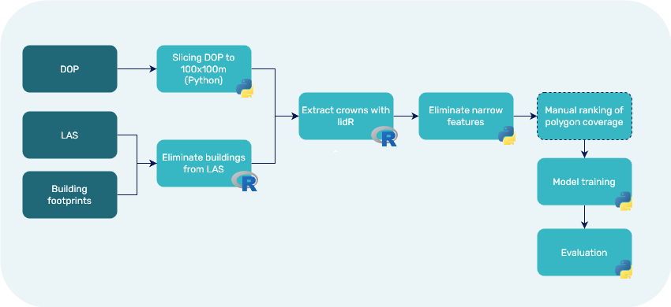

# Deep Learning-Based Segmentation of Individual Tree Crowns from Aerial Images Using LiDAR-Derived Annotations

## Data Sources

### DOP 2020
- **Description**: Digital Orthophoto (DOP) provides high-resolution (20cm) aerial imagery that serves as a base layer for various geospatial analyses. Tiles: 2km x 2km. Bildflug 01., 08., 12. und 16. August 2020.
- **Source**: [DOP Source Link](https://daten.berlin.de/datensaetze/digitale-farbige-orthophotos-2020-dop20rgb-wms)

### LAS
- **Description**: LAS files contain LiDAR point cloud data, which includes detailed 3D information about the Earth's surface, vegetation, and structures. Airborne Laserscanning Flug 24.02.2021, 25.02.2021 und 02.03.2021.
- **Source**: [LAS Source Link](https://fbinter.stadt-berlin.de/fb/berlin/service_intern.jsp?id=a_als@senstadt&type=FEED)

### Building Footprints (ALKIS)
- **Description**: Building footprints (ALKIS) are vector data representing the outline of buildings. This data is used to eliminate building points from the LiDAR data to avoid confusion with tree crowns.
- **Source**: [Building Footprints Source Link](https://www.berlin.de/sen/sbw/stadtdaten/geoportal/liegenschaftskataster/)
- **WFS**: https://fbinter.stadt-berlin.de/fb/wfs/data/senstadt/s_wfs_alkis_gebaeudeflaechen

# Methodology 

## 01. Preprocessing Steps/Prepare Training Data

### 1. DOP Slicing
- Slice the DOP into 100m x 100m segments to manage the data efficiently and to match the processing scale of the LiDAR data.

### 2. LAS and Building Footprints Integration
- Combine LAS data with building footprints to eliminate points corresponding to buildings from the LAS data. This step ensures that only vegetation and natural features are analyzed for tree crown extraction.

### 3. Tree Crown Extraction via lidR
- Using the dimensions of the DOP slices, crop the LAS data to correspond with each 100m x 100m segment.
- Extract tree crowns using the lidR package. lidR is an R package for manipulating and visualizing airborne laser scanning (ALS) data with an emphasis on forestry applications.

### 4. Data Cleaning
- Eliminate polygons with elongated shapes that are unlikely to represent tree crowns. This step helps in refining the dataset to include only tree-like shapes.

## 02. Ranking of Extraction Results
- Manually investigate all slices and rank them based on the quality of tree crown extraction. This ranking helps in selecting the best samples for model training.
- The following categories are used:
  - 100: more or less perfect, few rims are not perfectly included
  - 90: many rims are not perfectly included
  - 80: missing tree
  - 70: no other objects, but confusing geometries (spikes), missing trees
  - 60: other objects as trees digitized, many missing trees
  - 50 and below: many other objects, missing trees, confusing geometries

## 03. Model Training Using Detectron2

### 1. Create training and validation dataset
### 2. Model Training
- Using Detectron2 deep learning library to train a model on the ranked data. The model learns to identify and segment tree crowns from the input data.
- https://github.com/facebookresearch/detectron2/blob/main/MODEL_ZOO.md
  
**Configs:**
- Mask R-CNN (extension of Faster-RCNN with segmentation masks) with ResNet-50 (feature extraction) backbone + FPN
- Mask R-CNN with ResNet-101 FPN

## 04. Evaluation
- Evaluate the trained model on a separate validation set. + Detect Over/Underfitting
  ### 1. Evaluate model metrics
  ### 2. Test on new data
